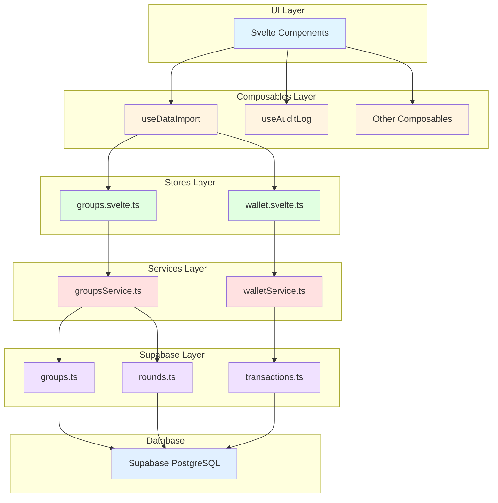

# Share Circle - สถาปัตยกรรมระบบ

## ภาพรวม (Overview)

Share Circle เป็นแอปพลิเคชัน Svelte/SvelteKit ที่ใช้สำหรับจัดการการแชร์ค่าใช้จ่ายระหว่างกลุ่มคน โดยมีความสามารถหลักในการ import ข้อมูลผ่าน file upload หรือ paste และจัดการ groups, rounds และ transactions

**สถิติ Codebase:**
- Files: 251
- Symbols: 1,031
- Processes: 70
- Functional Areas (Clusters): 4

## Functional Areas (Clusters)

### 1. Composables (71 symbols, 82% cohesion)
เป็นส่วนที่รวบรวม reusable logic และ composables สำหรับใช้งานใน Svelte components หลักๆ คือ:
- `useDataImport.svelte.ts` - จัดการการ import ข้อมูลผ่าน file upload และ paste
- `useAuditLog.svelte.ts` - บันทึก audit logs
- Composables อื่นๆ สำหรับจัดการ UI logic

### 2. Services (32 symbols, 85% cohesion)
เป็น business logic layer ที่คั่นกลางระหว่าง stores และ Supabase:
- `groupsService.ts` - จัดการ business logic สำหรับ groups และ rounds
- `walletService.ts` - จัดการ business logic สำหรับ wallet และ transactions
- Services อื่นๆ สำหรับ domain logic

### 3. Supabase (28 symbols, 85% cohesion)
เป็น data access layer ที่เชื่อมต่อกับ Supabase backend:
- `groups.ts` - CRUD operations สำหรับ groups
- `rounds.ts` - CRUD operations สำหรับ rounds
- `transactions.ts` - CRUD operations สำหรับ transactions

### 4. Stores (18 symbols, 75% cohesion)
เป็น state management layer ที่ใช้ Svelte stores:
- `groups.svelte.ts` - state สำหรับ groups
- `wallet.svelte.ts` - state สำหรับ wallet/transactions

## การไหลของข้อมูลหลัก (Key Execution Flows)

### 1. HandleFileUpload → CreateGroup
การอัปโหลดไฟล์เพื่อสร้าง group ใหม่:
```
handleFileUpload (useDataImport)
  → importData
    → doImportWithMode
      → doImport
        → add (groups store)
          → createGroupWithRounds (groupsService)
            → createGroup (Supabase)
```

### 2. HandleFileUpload → CreateRounds
การอัปโหลดไฟล์เพื่อสร้าง rounds:
```
handleFileUpload (useDataImport)
  → importData
    → doImportWithMode
      → doImport
        → add (groups store)
          → createGroupWithRounds (groupsService)
            → createRounds (Supabase)
```

### 3. HandleFileUpload → DeleteGroup
การอัปโหลดไฟล์เพื่อลบ group:
```
handleFileUpload (useDataImport)
  → importData
    → doImportWithMode
      → doImport
        → add (groups store)
          → createGroupWithRounds (groupsService)
            → deleteGroup (Supabase)
```

### 4. HandleFileUpload → CreateTransaction
การอัปโหลดไฟล์เพื่อสร้าง transaction:
```
handleFileUpload (useDataImport)
  → importData
    → doImportWithMode
      → doImport
        → addTransaction (wallet store)
          → addTransactionRecord (walletService)
            → createTransaction (Supabase)
```

### 5. HandleImportFromPaste → CreateGroup
การ import จาก paste เพื่อสร้าง group:
```
handleImportFromPaste (useDataImport)
  → importData
    → doImportWithMode
      → doImport
        → add (groups store)
          → createGroupWithRounds (groupsService)
            → createGroup (Supabase)
```

## สถาปัตยกรรมระบบ (Architecture Diagram)



## รูปแบบการเชื่อมต่อระหว่าง Layers

**Data Import Flow:**
1. UI ทริกเกอร์ file upload หรือ paste action
2. Composables (`useDataImport`) จัดการ parsing และ validation
3. Stores อัปเดต state ชั่วคราว
4. Services ประมวลผล business logic
5. Supabase layer ดำเนินการ CRUD กับ database

**Cross-Community Pattern:**
- Processes ส่วนใหญ่เป็น cross_community type แสดงถึงการเชื่อมต่อระหว่าง functional areas ต่างๆ
- ข้อมูลไหลจาก Composables → Stores → Services → Supabase

## เทคโนโลยีที่ใช้

- **Frontend Framework:** Svelte/SvelteKit
- **State Management:** Svelte Stores
- **Backend:** Supabase (PostgreSQL)
- **Language:** TypeScript
- **Architecture Pattern:** Layered Architecture (UI → Composables → Stores → Services → Supabase)

## จุดสำคัญในการพัฒนา

1. **Composables Layer:** เป็นจุดเริ่มต้นของการ import data และ UI logic
2. **Services Layer:** เป็นจุดที่ควรใส่ business logic และ validation
3. **Supabase Layer:** เป็น data access layer ที่ต้องเก็บไว้เพื่อเชื่อมต่อกับ database เท่านั้น
4. **Cross-Community Flows:** Processes ส่วนใหญ่ข้าม functional areas แสดงถึงการออกแบบที่เน้นการแยก concerns อย่างชัดเจน
